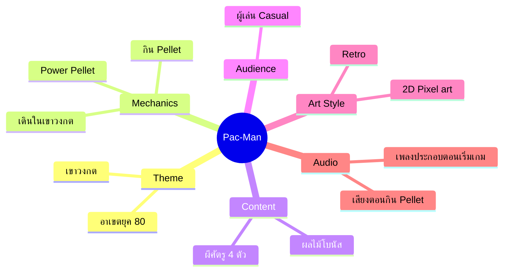
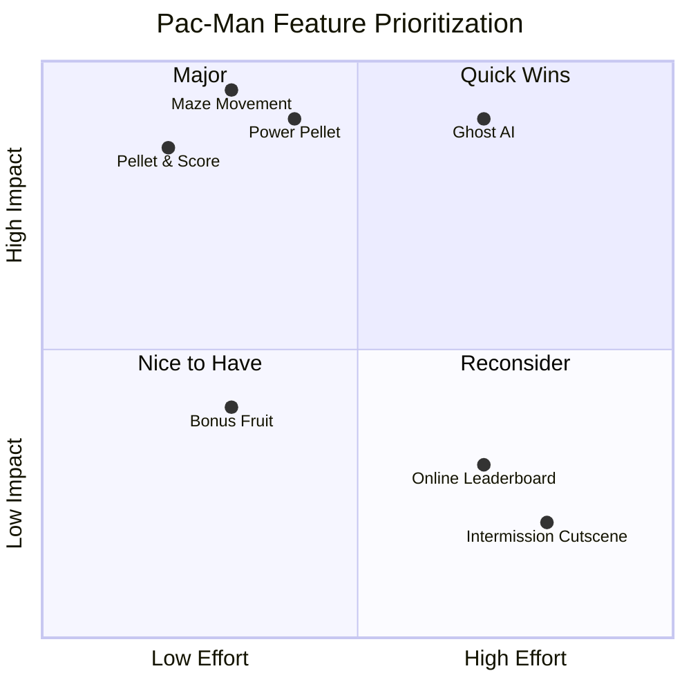
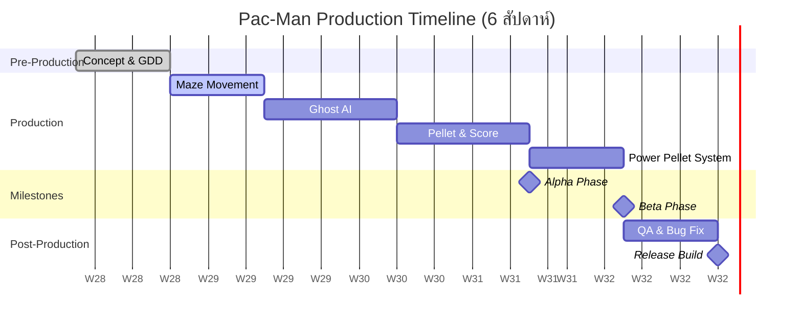

```mermaid
mindmap
  root((Pac-Man))
    Theme
      เขาวงกต
      อาเขตยุค 80
    Mechanics
      เดินในเขาวงกต
      กิน Pellet
      Power Pellet
    Content
      ผีศัตรู 4 ตัว
      ผลไม้โบนัส
    Audience
      ผู้เล่น Casual
    Art Style
     2D Pixel art
     Retro
    Audio
     เพลงประกอบตอนเริ่มเกม
     เสียงตอนกิน Pellet
```

```mermaid
quadrantChart
    title Pac-Man Feature Prioritization
    x-axis Low Effort --> High Effort
    y-axis Low Impact --> High Impact
    quadrant-1 Quick Wins
    quadrant-2 Major
    quadrant-3 Nice to Have
    quadrant-4 Reconsider
    
    Maze Movement: [0.3, 0.95]
    Ghost AI: [0.7, 0.9]
    Online Leaderboard: [0.7, 0.3]
    Pellet & Score: [0.2, 0.85]
    Power Pellet: [0.4, 0.9]
    Bonus Fruit: [0.3, 0.4]
    Intermission Cutscene: [0.8, 0.2]
```

```mermaid
gantt
    title Pac-Man Production Timeline (6 สัปดาห์)
    dateFormat YYYY-MM-DD
    %% คำสั่งแก้ตัวหนังสือซ้อนกัน: ให้แสดงเป็นสัปดาห์ที่ (W01-W06) แทนการแสดงวันที่รายวัน
    axisFormat W%V
    
    section Pre-Production
    Concept & GDD : done, c1, 2026-07-06, 5d
    
    section Production
    Maze Movement      : active, p1, after c1, 5d
    Ghost AI           : p2, after p1, 7d
    Pellet & Score     : p3, after p2, 7d
    Power Pellet System: p4, after p3, 5d
    
    section Milestones
    Alpha Phase : milestone, m1, after p3, 0d
    Beta Phase  : milestone, m2, after p4, 0d
    
    section Post-Production
    QA & Bug Fix  : q1, after p4, 5d
    Release Build : milestone, m3, after q1, 0d
```